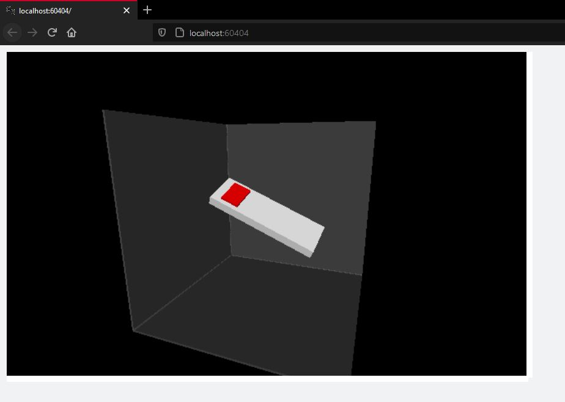

## Plot Nano orientation from IMU readings using VPython

 

This is just a proof of concept that demonstrates how the Nano's orientation can be derived based on IMU sensor 
values. The representation is not exact as deriving it from the IMU values presents some challenges. Namely:

*  Accelerometer data tells nothing about the rotation with respect to the vertical axis

*  Gyroscope angular speeds can be integrated to infer angular position, but results are inexact. Plus, the gyroscope 
values have a drifting error that makes it harder to adjust to get the real angular speed.

More complex techniques would be required to infer the exact position based on the IMU values.