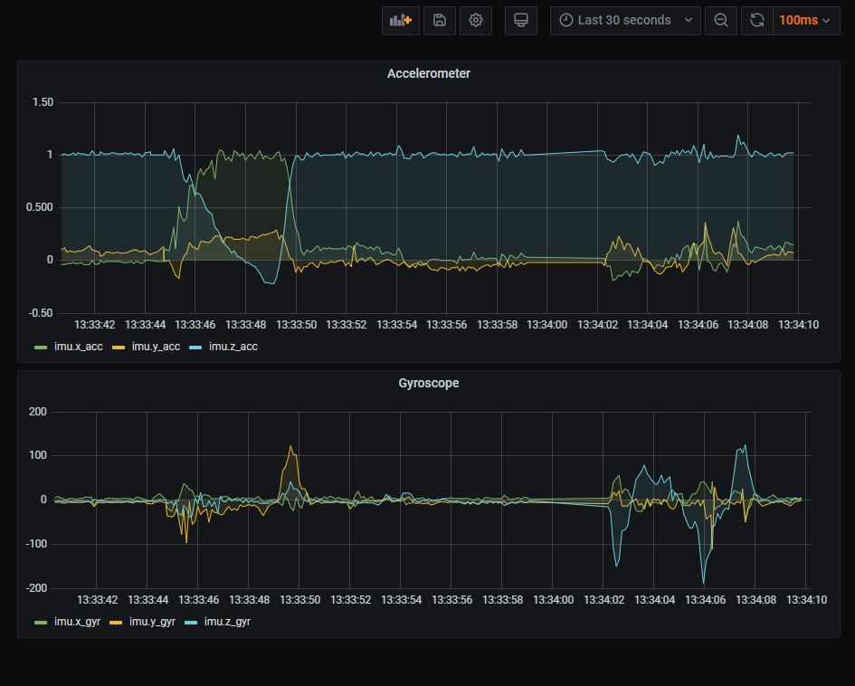

# Publishing, storing and displaying IMU sensor readings from an Arduino Nano 33

(Areas de Aplicación del IoT - UIB - MUSI 2020-21)

This repo provides the code and configuration needed to:
 
 * **Connect** an Arduino Nano 33 to a MQTT broker (mosquitto) with TLS broker authentication
 * **Read** the Nano 33 IMU sensor values and publish them via MQTT 
 * **Load** the published values in an Influx database using a Telegraf agent
 * **Display** the recorded values on a Grafana dashboard
 * The Nano is programmed with three possible **operating modes**:
    - *alltime*:  will publish IMU readings at the specified sample rate for as long as it is powered on
    - *ifmov*: will publish IMU readings at the specified sample rate only if movement is detected
    - *sleep*: won't publish IMU readings at all
 * The operating mode can be changed **remotely** by publishing an MQTT message on the topic `sensors\imu1\mode`, with the
 payload being the name mode name (e.g. "alltime")
 
 Screenshot of Grafana's dashboard:
 
 
  
 ## Usage
  
  To get it up and running simply update the parameters in `credentials.h` and upload the `imu_sensor.ino` sketch to the
  Nano board (requires the `WiFiNINA`, `PubSubClient` and `Arduino_LSM6DS3` libraries). You can also edit the sketch 
  to change some application parameters like the `sample_rate`. More detail is provided 
  in the next section.
  
  You also need properly configured instances of mosquitto (or any other mqtt broker), Telegraf, Influxdb and Grafana; 
  running on a server connected to the Internet or to the Nano's local network. This repo was tested running the four 
  services on a virtual machine with a Raspbian OS (but note that the four services don't need to be on the same 
  server as they communicate to each other over the network).
  
  The initial configuration section below assumes that you have already installed and set up the basic 
  configuration for the four services mentioned above, and only provides details on the adjustments needed to make them work over TLS or for this specific 
  application.   
  
 ## Nano operating logic
 
 At the top of the `imu_sensor.ino`  sketch the following parameters can be adjusted:
 * `pubTopic`: topic where the IMU readings will be published
 * `subTopic`: topic where the Nano will subscribe to receive instructions
 * `threshold`: minimum gyroscope absolute value to consider that the Nano is moving, used when the Nano is 
 operating in *ifmove* mode. Initial calibration showed that, even when stationary, the sensor would sometimes measure
 values in the -10 to +10 *dps* range, hence the current 10 threshold.
 * `sample_rate`: published readings per second. Note that according to the `Arduino_LSM6DS3` documentation, the 
 sampling rate is *104 Hz* so this is the maximum publishing rate that would make sense.   
 
 As opposed to other type of sensors, most of the IMU data use cases require a high sampling rate (e.g. infer a 
 particular type of movement), which can present a challenge on the storing side. Hence, the *ifmove* operating mode, which will
 only send data when movement is detected. 
 
 Some additional clarifications on the sketch logic:
 
  * The IMU readings are published as a single string in the Influx format, which allows the Telegraf
   to parse and load them directly into a measurements table in the Influx database.
  
  * On *ifmove* mode, values are published during one second after the last value above 
  the movement threshold is measured. This is to ensure that all the information of a given movement is captured.
  
  * Given how the logic is coded, sending any instruction other than *"alltime"* or *"ifmov"* will make the Nano go 
  into *sleep* mode.
 
 
 ## Initial configuration
  
 ### Generating the authentication certificate
 
We want the broker to authenticate in order to establish a connection with our Arduino Nano. We first need
to create a Certified Authority (we could also use a public one). To do so, we will follow the following steps using 
the `OpenSSL` libray. 

Generate a CA key and and a self-signed certificate (the root certificate): 
 
 `openssl req -new -x509 -days 365 -extensions v3_ca -keyout ca-master.key -out ca-master.crt`
 
Generate the broker's key:

`openssl genrsa -out broker.key 2048`

Generate the broker's certificate signature request (**Important**: when prompted to provide the certificate details, 
the *Common Name* field has to be the broker's server domain name or the servers IP address, depends on how you pass the 
server's address in `credentials.h`):

`openssl req -out broker.csr -key broker.key -new`
  
 Sign the broker's CSR with the CA:
 
 `openssl x509 -req -in broker.csr -CA ca-master.crt -CAkey ca-master.key -CAcreateserial -out broker.crt -days 180`
 
 ### Configuring mosquitto for TLS
 
 See the `mosquitto.conf` in this repo.
 
 A copy of the root certificate, the broker's certificate and the broker's key must be stored in mosquitto's server.
 The config file `mosquitto.conf` must be updated to indicate the path to these files, as well as the TLS version to use. 
 
 Since we are doing broker authentication only (not the Nano), don't include the line `require_certificate true`. Otherwise the broker will 
 reject the connection. 
 
 The current configuration expects the Nano to also provide a username and password, hence the `allow_anonymous false`.
 
 ### Upload the root certificate to the Nano board
 
 Follow the steps on this 
 [tutorial](https://support.arduino.cc/hc/en-us/articles/360016119219-How-to-add-certificates-to-Wifi-Nina-Wifi-101-Modules-),
  and when prompted to enter the website from where to fetch the SSL certificate, just add the IP and port 
 of the mosquitto server (or the domain name if it has one).
 
 ### Configuring Telegraf
 
 See the `telegraf.conf` in this repo.
 
 After creating an Influx database to store the IMU measurements, the influxDB credentials and the database name must be 
 updated in `telegraf.conf`. 
 
 The MQTT credentials and details must also be provided. The Telegraf agent must subscribe to the topic where the Nano
 is publishing the IMU readings (in this example it is `sensors/imu1/values/#`). To connect over TLS the 
 server address must start with `ssl://` and the the path to the root certificate must be added.  
 
 ### Configuring Grafana
 
 The only setting required in Grafana which is somewhat specific for this use case (apart from obviously creating the 
 dashboard with the IMU data charts), is to change the `min_refresh_interval` setting from the 
 default `5s` to `100ms` on `grafana.ini`. 
 
 An exact dashboard like the one I built can be created by importing the JSON `grafana_dashboard` included in this repo.
 

 
 
 
 
 
  
 
 